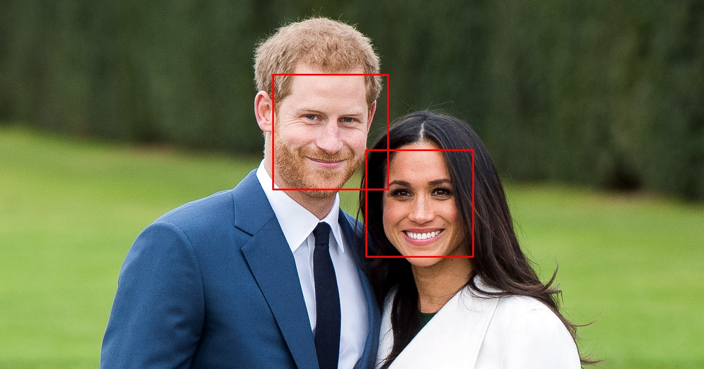

# Face-Recognition
Face detction and recognition using OpenCV, Haarcascade and KNN

## Usage
### To detect faces from images

Save images in test_images folder and then run:

```
python face_detection_images.py
```

The output images will be saved in output folder

### Test Image


### Output image


### To capture data from webcam

Run:
```
python Image_capturing.py
```

### To start face recognition

Run:
```
python face_recognise.py
```
## Demo

